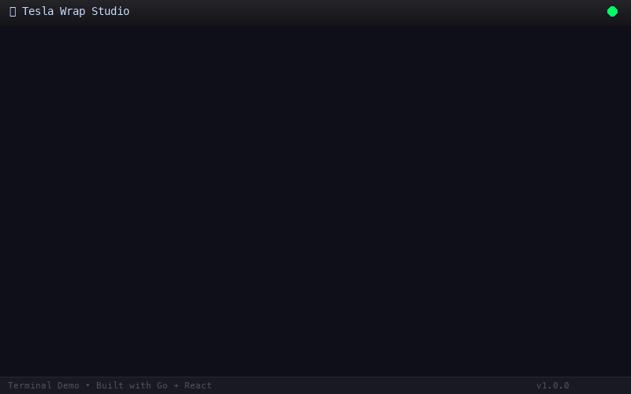

# 🚗 Tesla Wrap Studio

**Custom Tesla Vehicle Wrap Design Tool — 自定义特斯拉车身贴膜设计工具**

Upload 5 photos (front, rear, left, right, top) of your Tesla, drag to adjust, and auto-render onto your vehicle's wrap template. Supports all 12 Tesla models.

上传 5 个角度（前、后、左、右、顶视图）的照片，自动映射到特斯拉车身贴膜模板上，支持拖拽调整位置，一键导出 PNG。支持全系 12 款车型。

---

## 📖 Table of Contents / 目录

- [Screenshots / 截图](#screenshots)
- [Supported Models / 支持车型](#supported-models)
- [Quick Start / 快速开始](#quick-start)
- [Usage / 使用方法](#usage)
- [Tech Stack / 技术栈](#tech-stack)
- [Project Structure / 项目结构](#project-structure)
- [Development / 开发指南](#development)
- [License / 许可证](#license)

---

## Screenshots

> *(Insert screenshot or demo video here / 在此插入截图或演示视频)*



<table>
  <tr>
    <td></td>
    <td></td>
  </tr>
  <tr>
    <td align="center"><b>Upload Panel / 上传面板</b></td>
    <td align="center"><b>Adjust Panel / 调整面板</b></td>
  </tr>
</table>

---

## Supported Models / 支持车型

| Model / 车型 | Variants / 版本 |
|---|---|
| **Cybertruck** | ⚡ |
| **Model 3** | Standard, 2024+ Base, 2024+ Performance |
| **Model Y** | Standard, 2025+ Base, 2025+ Performance, 2025+ Premium, Model Y L |
| **Model S** | 2021, 2025+ Plaid |
| **Model X** | 2021 |

---

## Quick Start / 快速开始

### 1. Download the binary / 下载二进制文件

**macOS / Linux:**
```bash
# Download the latest release (or build from source)
# 下载最新版本（或源码编译）
```

### 2. Run the server / 启动服务

```bash
cd backend
./tesla-wrap-studio
```

Or specify a custom port / 或指定端口:
```bash
PORT=3000 ./tesla-wrap-studio
```

### 3. Open in browser / 在浏览器中打开

→ **http://localhost:8080**

---

## Usage / 使用方法

### 🇺🇸 English

1. **Select a vehicle model** — Choose your Tesla from the dropdown (12 models available)
2. **Upload photos** — Upload 5 photos: **Front, Rear, Left, Right, Top**
   - Click or drag & drop images into each view box
   - Supported formats: JPEG, PNG, WebP, GIF
3. **Adjust views** (optional) — Switch to the "Adjust" tab
   - **Scale**: 30%–200%
   - **Rotate**: -180° to +180°
   - **Offset**: Horizontal & vertical fine-tuning (±50px)
   - **Flip**: Mirror horizontally
4. **Preview** — The right panel shows your custom wrap in real-time
5. **Render** — Click "🎨 Generate Wrap" to composite the final image
6. **Download** — Click "⬇️ Download PNG" to save the result

### 🇨🇳 中文

1. **选择车型** — 从下拉菜单选择您的特斯拉车型（共 12 款）
2. **上传图片** — 依次上传 **前、后、左、右、顶** 5 个角度的照片
   - 点击或拖拽图片到对应的视图框中
   - 支持 JPEG、PNG、WebP、GIF 格式
3. **调整视图**（可选）— 切换到「调整视图」标签
   - **缩放**：30%–200%
   - **旋转**：-180° 到 +180°
   - **偏移**：水平和垂直微调（±50px）
   - **翻转**：水平镜像翻转
4. **预览** — 右侧面板实时显示贴膜效果
5. **渲染** — 点击「🎨 生成 Wrap」合成最终图片
6. **下载** — 点击「⬇️ 下载 PNG」保存结果

---

## Tech Stack / 技术栈

| Layer | Technology | Purpose |
|-------|-----------|---------|
| **Backend** | Go 1.25 | HTTP server, image rendering |
| **Frontend** | React 19 + Vite | UI, preview, drag-and-drop |
| **Image Processing** | Go `image` / `imaging` | Compositing, scaling, rotation, color blending |
| **Templates** | Tesla Official PNG | 12 vehicle wrap templates |

---

## Project Structure / 项目结构

```
tesla-wrap-studio/
├── backend/                      # Go backend
│   ├── main.go                   # HTTP server + API handlers
│   ├── go.mod                    # Go module
│   ├── tesla-wrap-studio         # Compiled binary
│   ├── view_mappings.json        # Pre-computed view coordinates for 12 models
│   ├── templates/                # Vehicle wrap templates (12 subdirectories)
│   │   ├── cybertruck/
│   │   ├── model3/
│   │   ├── modely/
│   │   ├── models-2021/
│   │   ├── modelx-2021/
│   │   └── ...
│   ├── internal/
│   │   ├── model/model.go        # Vehicle model data + view detection
│   │   └── renderer/renderer.go  # Image compositing engine
│   └── frontend/dist/            # Built frontend assets
├── frontend/                     # React frontend source
│   ├── src/
│   │   ├── App.jsx               # Main React component
│   │   ├── App.css               # Styles (dark theme)
│   │   └── main.jsx              # Entry point
│   ├── package.json
│   └── vite.config.js
└── README.md
```

---

## API Endpoints / API 接口

| Method | Path | Description |
|--------|------|-------------|
| `GET` | `/api/models` | List all vehicles |
| `GET` | `/api/models/:id` | Get vehicle details + view coordinates |
| `GET` | `/api/models/:id/template` | Get template PNG |
| `POST` | `/api/render` | Render wrap (multipart form) |

### Render API Example

```bash
curl -X POST http://localhost:8080/api/render \
  -F "model_id=cybertruck" \
  -F "front=@/path/to/front.jpg" \
  -F "rear=@/path/to/rear.jpg" \
  -F "adjustments={\"front\":{\"scale\":120,\"rotate\":0}}"
```

---

## Development / 开发指南

### Build from source

```bash
# Backend
cd backend
go build -o tesla-wrap-studio .

# Frontend
cd frontend
npm install
npm run build

# Run
cd ../backend
./tesla-wrap-studio
```

### Frontend dev mode (hot reload)

```bash
cd frontend
npm run dev
# Opens on http://localhost:5173 (proxies /api to :8080)
```

---

## License / 许可证

MIT License

---

*Built with ❤️ using Go + React*
