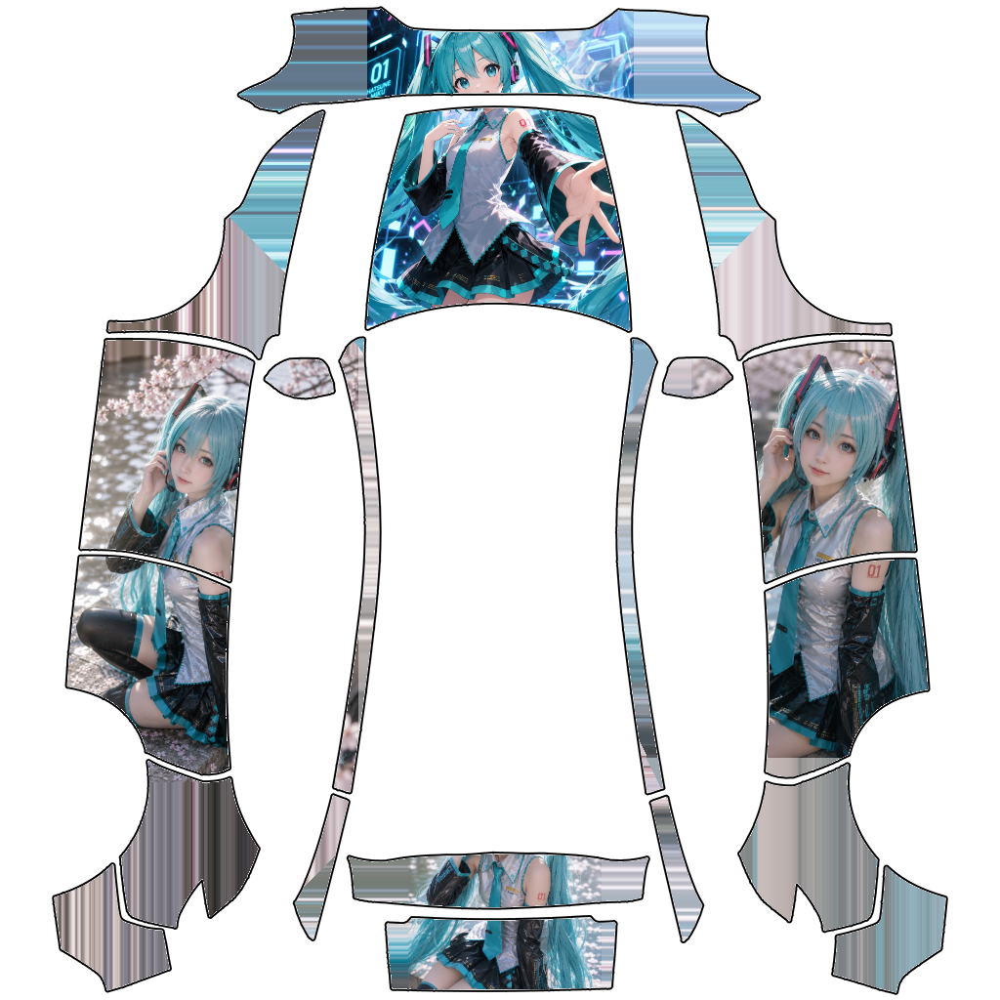

# 🚗 Tesla Wrap Studio

**Tesla 智能车衣设计器 — Canvas-based Tesla wrap design tool**

自由拖放图片到 Canvas 上，一键生成车身贴膜效果图。支持 6 款特斯拉车型模板。

Drag & drop images onto a Fabric.js canvas, preview your custom wrap in real-time, and export as PNG.

---

## Screenshot / 截图



---

## Supported Models / 支持车型

| Model | Template File |
|-------|--------------|
| Cybertruck | `Cybertruck.png` |
| Model 3 (2024+) | `model-3-2024.png` |
| Model 3 Performance | `model-3-p.png` |
| Model Y | `model-y.png` |
| Model Y (2025+) | `model-y+.png` |
| Model Y L | `model-YL.png` |

---

## Quick Start / 快速开始

### Download & Run

```bash
git clone git@github.com:Dushibing/tesla-wrap-studio.git
cd tesla-wrap-studio
go build -o tesla-wrap-studio .
./tesla-wrap-studio
```

Then open **http://localhost:12345**

The server auto-opens your browser on startup.

---

## Usage / 使用方法

### 🇨🇳 中文

1. **选择车型** — 从下拉菜单选择 Tesla 车型
2. **上传图片** — 点击四个上传区域分别上传：
   - 车头 / Hood（前）
   - 左侧 / Left（左）
   - 右侧 / Right（右）
   - 车尾 / Rear（后）
3. **自由调整** — 在 Canvas 上拖拽图片到合适位置，滚轮缩放
4. **生成预览** — 点击「生成预览」
5. **保存下载** — 确认后点击「确认保存」下载 PNG

### 🇺🇸 English

1. **Select model** — Choose a Tesla vehicle from the dropdown
2. **Upload images** — Upload 4 view images (hood, left, right, rear)
3. **Position freely** — Drag images on the Canvas, scroll to scale
4. **Generate** — Click "Generate Preview"
5. **Download** — Click "Save .PNG" to download the result

---

## Tech Stack / 技术栈

| Layer | Technology |
|-------|-----------|
| Backend | Go — single binary with `//go:embed` templates |
| Frontend | Embedded HTML + Fabric.js 5 Canvas |
| Algorithm | BFS smart fill (color propagation) + template mask compositing |
| Templates | PNG template files embedded at compile time |

---

## How It Works / 工作原理

```
User uploads images → Fabric.js Canvas (free positioning)
        ↓
   Canvas screenshot (base64 PNG)
        ↓
   POST /process → Go backend
        ↓
   smartFillBFS() — fills transparent pixels by color propagation
        ↓
   applyTemplateMask() — composites result onto vehicle template
        ↓
   Return composited PNG → Preview modal → Download
```

### Core Algorithms / 核心算法

**smartFillBFS** — 广度优先颜色扩散
- Seeds from all non-transparent pixels
- Propagates color to all reachable transparent pixels
- Equal-area canvas fill with parallel edge rendering

**applyTemplateMask** — 模板遮罩合成
- 8-worker parallel pixel processing
- Template white areas are preserved (transparent)
- Non-white template pixels overlay on result

---

## Project Structure / 项目结构

```
tesla-wrap-studio/
├── main.go              # Go server + embedded HTML frontend
├── go.mod               # Go module (tesla-wrap-gen)
├── go.sum
├── templates/           # Vehicle templates (embedded at build time)
│   ├── Cybertruck.png
│   ├── model-3-2024.png
│   ├── model-3-p.png
│   ├── model-y.png
│   ├── model-y+.png
│   └── model-YL.png
├── README.md
└── tesla-wrap-studio    # Compiled binary
```

---

## API

| Method | Path | Description |
|--------|------|-------------|
| `GET` | `/` | Main page (embedded HTML) |
| `POST` | `/process` | Generate wrap (multipart: `image_data` base64 + `model_id`) |
| `GET` | `/templates/:name.png` | Serve embedded template image |

---

## License / 许可证

MIT

---

*Built with Go + Fabric.js — single binary, zero dependencies at runtime*
